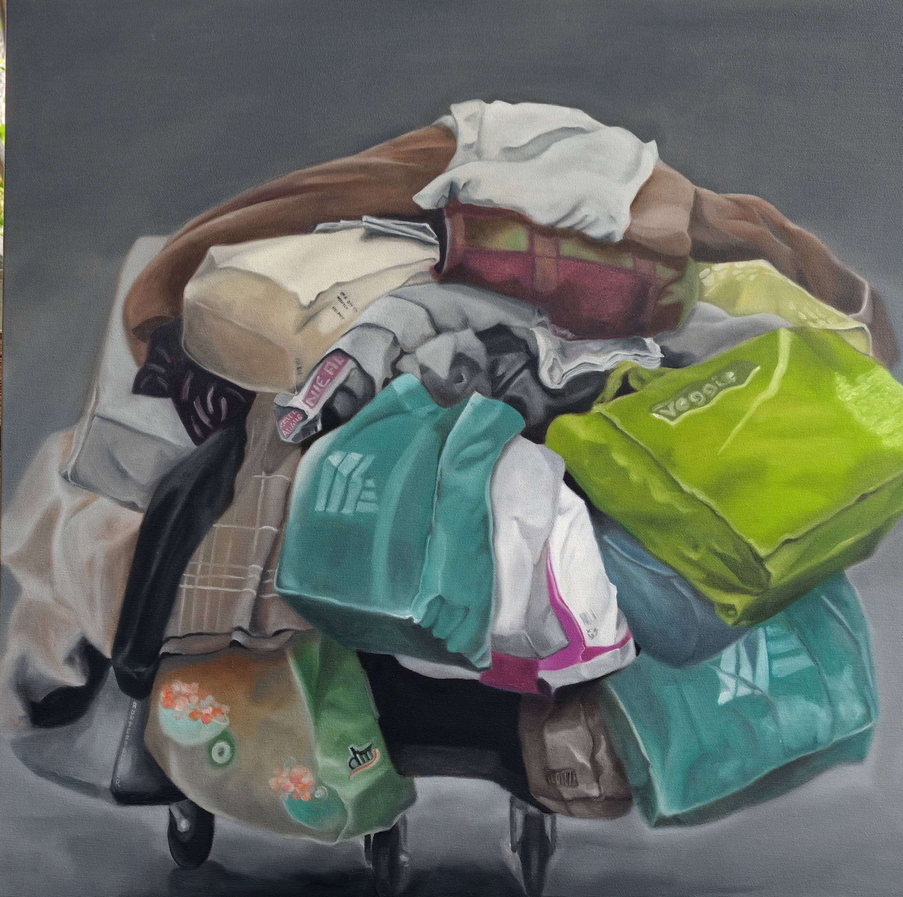

# Überleben im Überfluss

**Titel:** Überleben im Überfluss 
**Technik:** Öl auf Leinwand  
**Größe:** 80 × 80 × 4,5 cm  
**Jahr:** 2026  
**Preis:** € 2.300

## Bildbeschreibung

Wie ein überfüllter Organismus türmt sich das Gepäck auf dem Wagen. Taschen, Stoffe und persönliche Dinge verdichten sich zu einer beinahe menschlichen Gestalt - schwer, verletzlich und dennoch in Bewegung.

Das Werk erzählt vom Leben im Großstadtdschungel: vom rastlosen Unterwegssein, vom Festhalten und von all dem, was wir zu brauchen glauben. Der Überfluss verspricht Sicherheit, wird jedoch zunehmend zur Last. Obwohl kein Mensch zu sehen ist, entsteht
ein stilles Porträt unserer Gesellschaft.

Was besitzen wir - und was besitzt längst uns?
